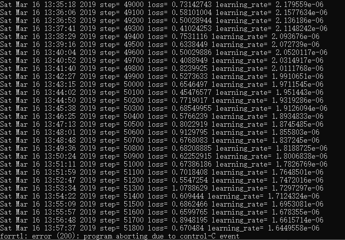
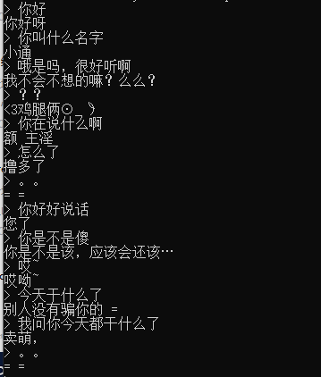

# chatbot
## v1：一个API实现，很大程度上参考自[自己动手做聊天机器人](http://www.shareditor.com/blogshow?blogId=136)
1、所用API为tf.contrib.legacy_seq2seq.embedding_attention_seq2seq，这一个API就实现了词嵌入、注意力以及seq2seq模型，虽然方便，但集成度太高也是它的缺点，**且将被弃用**  

2、所用语料为小黄鸡聊天记录，共40万左右的对话，但由于本人机器所限，所以只用了1万个对话进行训练

3、`python demo.py train`进行训练，训练了51800步，如下：  

4、`python demo.py predict`进行预测，对话效果如下：  
